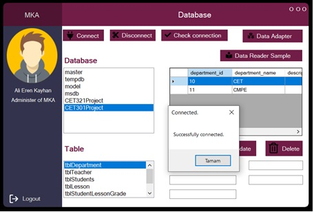
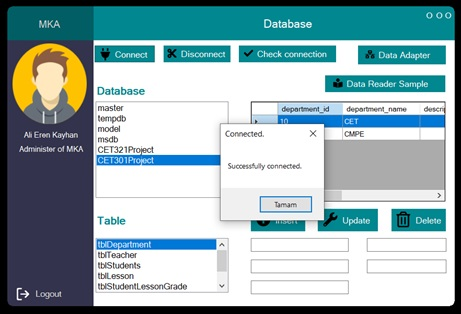
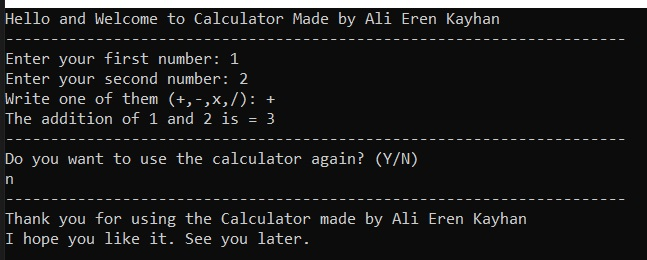
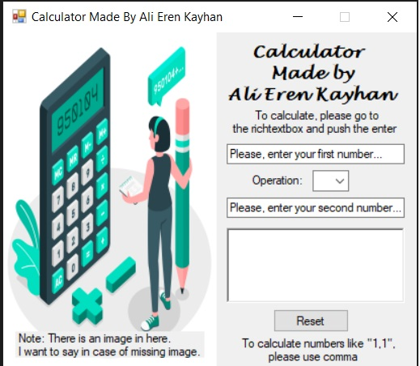
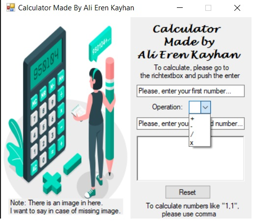
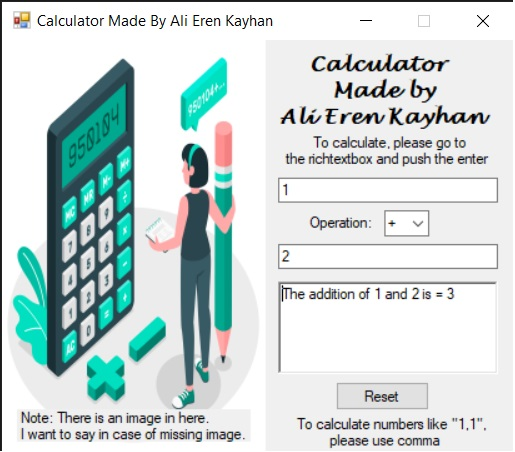

    
# CET-301

This repository is for my CET 301 lesson's works. 
These projects are desktop application and made by C#.
There is more explanation in documents for AlierenkayhanCET301proje.

## Table of Contents

* [General Info](#CET-301)
* [Technologies Used](#Technologies)
* [Prerequisites](#Prerequisites)
* [Features](#Features)
* [Screenshots](#Screenshots)
* [Lisans](#Lisans)
* [Feedback](#Feedback)
* [Reference](#Reference)
 
## Technologies
-  
-  
- 
 
## Prerequisites
    - You have sql for AlierenkayhanCET301proje and you have to connect it.

## Features
1-Features of AlierenkayhanCET301proje  
    - User-friendly interface  
    - Managing Database  
    - Login System  
    - Having different color in every login  

2-Features of AliErenKayhanCalculatorHomework  
    - User-friendly interface  
    - Easy to use  
    
3-Features of AliErenKayhanCalculatorHomework2  
    - User-friendly interface  
    - Easy to use  
   
## Screenshots
  1-Screenshots of AlierenkayhanCET301proje
  <table> 
    <tr>
        <td>  
</td>
        <td>  
</td>
        <td> 
</td>
    </tr>
   </table>
 
 
 
 
   2-Screenshots of AliErenKayhanCalculatorHomework
  <table> 
    <tr>
        <td>  
</td>
    </tr>
   </table>
 
  
   3-Screenshots of AliErenKayhanCalculatorHomework2
  <table> 
    <tr>
        <td>  
</td>
        <td>  
</td>
        <td> 
</td>
    </tr>
   </table>

## Lisans

This project is licensed under the terms of the [MIT](https://choosealicense.com/licenses/mit/) license.

  
## Feedback

If you have any feedback, please contact me at ali_erenbatman@hotmail.com.
  
## Reference
    -https://github.com/alexandresanlim/Badges4-README.md-Profile
    -https://shields.io/
